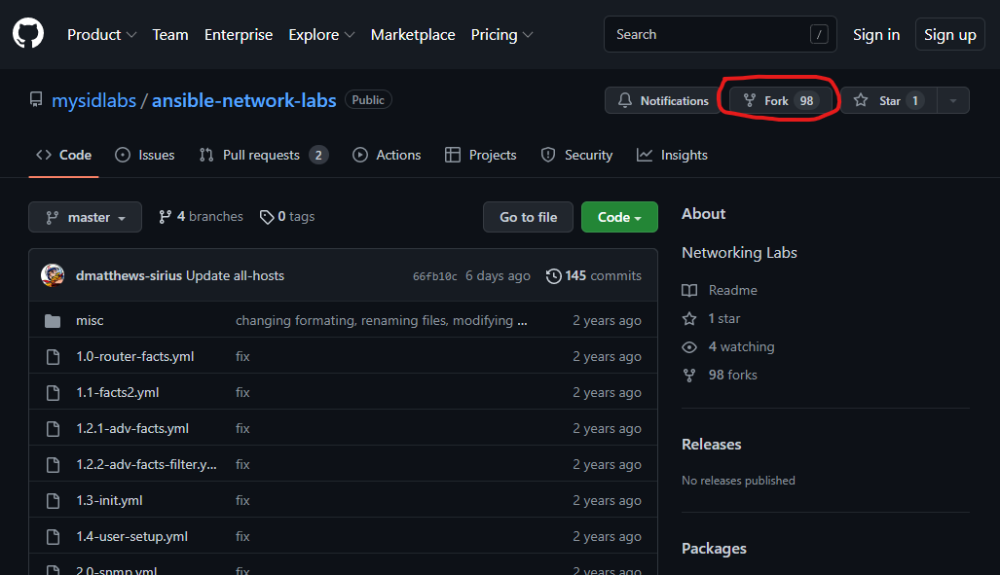
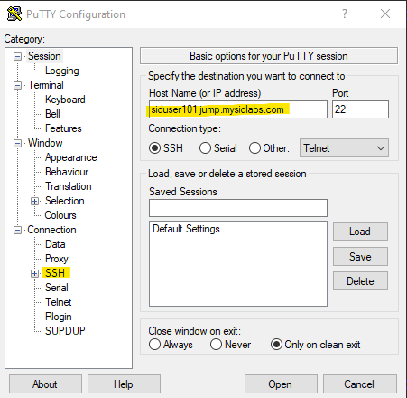
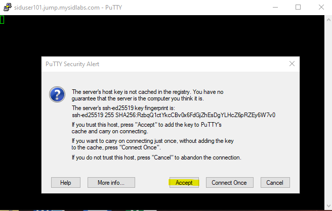
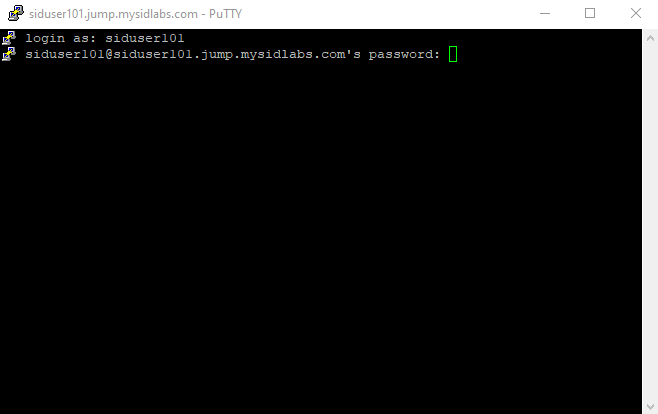
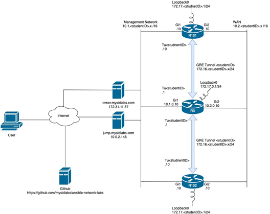
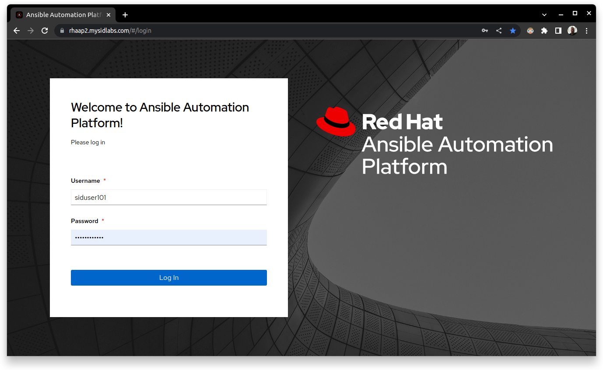
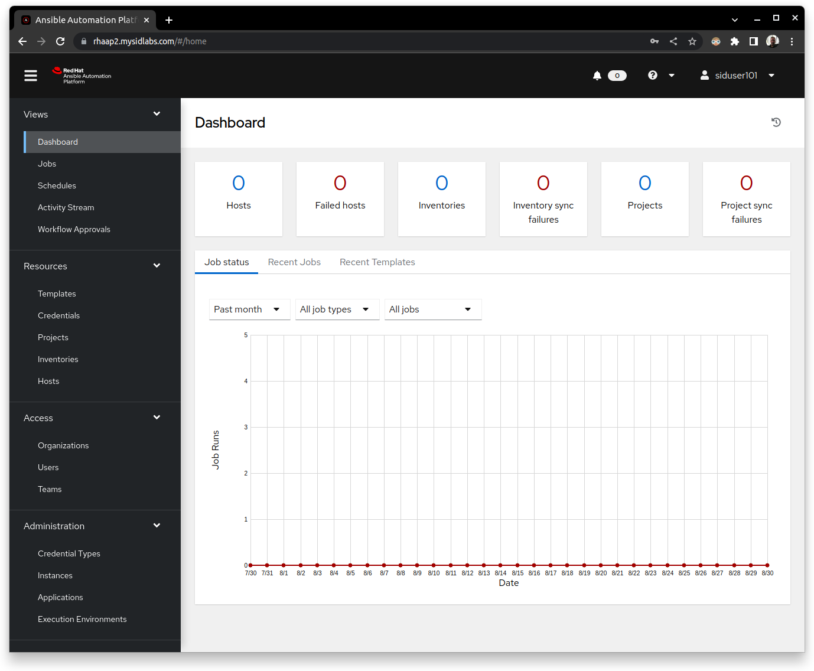

# Network Lab Immersion Day Lab Outline
* Part 1: Getting setup
  * Fork Git Repo 
  * SSH to jump station 
  * Downloading forked Git Repo 
* Part 2: Explore the environment 
  * Explore the environment with shell and Ansible ad-hoc commands 
  * Investigate Ansible’s configuration and Inventory 
  * Connect to the Routers using Ansible 
* Part 3: Backup, Configure, and Explore the Routers facts 
  * Lab 1 
    * Directory structure review 
    * Understand and use facts 
    * Run initial playbook to put basic configuration on Router 
  * Lab 2 
    * Gather banner information and reconfigure the banner  
    * Backup router configuration  
    * Restore router configuration from files 
  * Lab 3 
    * Configure DNS and loopback interface  
    * Create GRE tunnel and setup routing 
    * Secure router by pushing secure configuration file to router  
    * Ping another student router from loopback interface 
  * Lab 4 
    * Access Ansible Automation Controller 
    * Build a backup job with scheduling 
    * Interact with a job containing a Survey 

## Part 1: Initial Setup
### Overview
* Fork the lab github repository to your own repository so you can edit and modify. 
* Accessing the jump station 
* Downloading your forked repository to the jump station 

### Fork the Sirius Ansible networking GitHub Repository
1. Login to [Github](https://github.com)
1. Go to [https://github.com/mysidlabs/f5-ansible-labs](https://github.com/mysidlabs/f5-ansible-labs)
1. Click on the Fork button in the upper-right section of the page:

> **Note**: Once forked, you can modify all files within Github***

### Connect to your jump host
#### ***For MacOS, Linux, or WSL (Windows subsystem for Linux)***

Connect to your jump host where ### is replaced by your user number.  

```
>>  ssh siduser<###>@siduser<###>.jump.mysidlabs.com
Password: <<< password >>>
```
> **Note**: The password will be provided by the lab instructor.

You should then see the following:
```bash
Welcome to the CDW/Sirius Red Hat Immersion Day lab environment
+-+-+-+-+-+-+-+-+-+-+-+-+-+-+-+-+-+-+-+-+-+-+-+-+-+-+-+-+-+-+-+
siduser101@jump:~$ 
```
#### ***For Windows Users***
The following is an example using Putty.

* Type `siduser###.jump.mysidlabs.com` (where ### is your numeric userid) and click the Open button.

    

* Click the yes button to accept the ssh key

    

* Type in your username and password in the terminal screen

    

### Clone your repository
Now use the `git clone` command to download your remote repository to the local jump host.
```bash
    Welcome to the CDW/Sirius Red Hat Immersion Day lab environment
    +-+-+-+-+-+-+-+-+-+-+-+-+-+-+-+-+-+-+-+-+-+-+-+-+-+-+-+-+-+-+-+
    siduser254@jump:~$ git clone https://github.com/<your github userid>/ansible-network-labs.git
    Cloning into 'ansible-network-labs'...
    remote: Enumerating objects: 533, done.
    remote: Counting objects: 100% (36/36), done.
    remote: Compressing objects: 100% (28/28), done.
    remote: Total 533 (delta 19), reused 20 (delta 8), pack-reused 497
    Receiving objects: 100% (533/533), 97.57 KiB | 4.07 MiB/s, done.
    Resolving deltas: 100% (324/324), done.
    siduser254@jump:~$ ls
    ansible-network-labs
    siduser254@jump:~$ 
```

## Part 2: Explore the environment
### Overview
* Review the topology
* Modify your inventory file
* Review Ansible's configuration and Inventory files
* Use ansible ad-hoc commands to use the ping, ios_command and cli_command modules to connect to your router

### Installed tools:
  * `git` - command line tool to interact with git source control repositories.
  * `podman` - a name-spaced drop in replacement for the docker cli.
  * `nano` - a simple text editor.
  * `vim` - a powerful text editor.
  * `ansible-builder` - a command line wrapper to podman to build execution environments.
  * `ansible-navigator` - a powerful replacement to the old ansible-playbook command.
  * `ansible-vault` - a command line encryption tool to protect secrets for ansible-playbooks.
  * `tree` - a command line utilitiy to show recursive directory listings in a visual format.

    We will be editing text files throught the course of this lab.  Both `nano` and `vim` are available.  If you are inexperienced with `vim`,  `nano` will be the better choice, as it behaves more like a basic text editor.

### Topology
The topology is simple for the sake of learning some ansible basics. Traffic will traverse the R0 router and by the end you should be able to ping from your loopback interface to other loopback interfaces in the lab.  There will be GRE (Generic Routing Encapsulation) tunnel between every student router and R0 by the end which will allow traffic to be routed between devices.  The diagram below is an example, it shows the instructor router R0 and 2 student routers but there is a router for every student.




## Lab 1 - `ansible-navigator` and execution environments
1. Review the project structure. 
    ```bash
    siduser101@jump:~$ cd ansible-network-labs/
    siduser101@jump:~/ansible-network-labs$ ls
    1.0-router-facts.yml        2.1-banner.yml          32-secure-config.cfg   encrypt.yml
    1.1-facts2.yml              2.2-backup.yml          3.2-secure-config.yml  hosts
    1.2.1-adv-facts.yml         2.3-cli-backup.yml      4.0-tower-backup.yml   misc
    1.2.2-adv-facts-filter.yml  2.4-adv-cli-backup.yml  4.1-tower-snmp.yml     README.md
    1.3-init.yml                2.5-restore-backup.yml  all-hosts              tower-hosts
    1.4-user-setup.yml          3.0-dns-cfg.yml         ansible.cfg            vars.yml
    2.0-snmp.yml                3.1-gre.yml             ansible-navigator.yml
    siduser101@jump:~/ansible-network-labs$ 
    ```
2. Review your ansible.cfg
    ```bash
    siduser101@jump:~/ansible-network-labs$ vim ansible.cfg
    ```
    ```vim
    1 [defaults]
    2 deprecation_warnings         = False
    3 gathering                    = explicit
    4 retry_files_enabled          = False
    5 inventory                    = ~/ansible-network-labs/hosts
    6 timeout                      = 60
    7 forks                        = 50
    8 host_key_checking            = False
    9 
    10 [ssh_connection]
    11 ssh_args                     = -o ControlMaster=auto -o ControlPersist=30m
    12 ansible_ssh_common_args      = ' -oKexAlgorithms=+diffie-hellman-group1-sha1 -caes128-cbc'
    13 scp_if_ssh                   = True
    14 
    15 [paramiko_connection]
    16 host_key_auto_add            = True
    17 
    18 [persistent_connection]
    19 connect_timeout              = 60
    20 command_timeout              = 60
    
    ```
    > **INFO**: This is the configuration that ansible will use if you are in the ~/ansible-network-labs directory. If the inventory setting was missing this would tell you that ansible will default to /etc/ansible/hosts.
3. Explore your inventory file
    ```bash
    siduser101@jump:~/ansible-network-labs$ vim hosts
    ```
    ```vim
    1 [all: vars]
    2 ansible_user=ec2-user
    3 ansible_ssh_private_key_file=~/.ssh/network-key.pem
    4 ansible_port=22
    5 
    6 [routers: children]
    7 cisco
    8 juniper
    9 
    10 [cisco]
    11 R<studentID> ansible_host=10.1.<studentID>.10
    12 
    13 [cisco: vars]
    14 ansible_network_os=ios
    15 
    16 [juniper]
    17 
    18 [juniper: vars]
    19 ansible_network_os=junos
    20 
    21 [arista]
    22 
    23 [arista: vars]
    24 ansible_network_os=eos
    ~                                                                                                         
    ~                                                                                                         
    ~                                                                                                         
    ~                                                                                                         
    ~                                                                                                         
    <ansible-network-labs/hosts [FORMAT=unix] [TYPE=] [POS=1,1][4%] [BUFFER=1] Fri 26 Aug 2022 05:17:18 PM UTC
    :

    ```
    > **Note**:  Ansible uses ansible_network_os to inform Ansible which network platform this hosts corresponds too. This is required when using connection plugins network_cli or netconf. We will be using ansible_connection: network_cli later which is automatically combined with this.    
    
    Here for example ansible_network_os=ios tells Ansible the Networking Operating System is Cisco’s ios. Platforms supported by ansible_network_os include:    

    | Networking Platform | Ansible Network OS |
    |---|---|
    |Cisco IOS|ios|
    |Cisco IOS-XR|iosxr|
    |Cisco NX-OS|nxos|
    |Arista EOS|eos|
    |Juniper JUNOS|junos|
    |F5 Big IP|f5|

1. Modify your inventory file by updating your student router name to use your student id.
    > **Note**: The lab guide will be using vim to show these edits. But you may use *nano* or edit the file directly in github and then use `git pull` to update your local files.

    In vim this can be done by using a global search and replace:  Type `:` to enter the expression: `%s/<studentID>/101/g` and press enter.
    ```vim
    1 [all:vars]
    2 ansible_user=ec2-user
    3 ansible_ssh_private_key_file=~/.ssh/network-key.pem
    4 ansible_port=22
    5 
    6 [routers:children]
    7 cisco
    8 juniper
    9 
    10 [cisco]
    11 R101 ansible_host=10.1.101.10
    12 
    13 [cisco:vars]
    14 ansible_network_os=ios
    15 
    16 [juniper]
    17 
    18 [juniper:vars]
    19 ansible_network_os=junos
    20 
    21 [arista]
    22 
    23 [arista:vars]
    24 ansible_network_os=eos
    ~                                                                                                         
    ~                                                                                                         
    ~                                                                                                         
    ~                                                                                                         
    ~                                                                                                         
    <le-network-labs/hosts[+] [FORMAT=unix] [TYPE=] [POS=11,1][45%] [BUFFER=1] Fri 26 Aug 2022 05:40:14 PM UTC
    :%s/<studentID>/101/g

    ```
    Save the file  `:wq`

1. Validate that Ansible can see the hosts in your inventory.
    ```bash
    siduser101@jump:~/ansible-network-labs$ ansible all --list-hosts
    hosts (1):
        R101
    siduser101@jump:~/ansible-network-labs$
    ```
    > *TIP:* The ***all*** field in the previous command refers to the automatically created group ‘all’. You can retry the command using another group name or hostname instead. For example, ***cisco***,  ***routers*** or ***R101***.  Using Groups liberally in inventory files gives flexibility in the long run and is considered a Best Practice.

## Part 3: Investigate the Network Infrastructure
1. Check if the jump host can connect to the router.
    ```bash
    siduser101@jump:~/ansible-network-labs$ ping 10.1.101.10
    PING 10.1.101.10 (10.1.101.10) 56(84) bytes of data.
    64 bytes from 10.1.101.10: icmp_seq=1 ttl=255 time=0.585 ms
    64 bytes from 10.1.101.10: icmp_seq=2 ttl=255 time=0.576 ms
    64 bytes from 10.1.101.10: icmp_seq=3 ttl=255 time=0.558 ms
    ^C
    --- 10.1.101.10 ping statistics ---
    3 packets transmitted, 3 received, 0% packet loss, time 2041ms
    rtt min/avg/max/mdev = 0.558/0.573/0.585/0.011 ms
    ```
    > **Tip**:  Mac users:  control-c to stop the ping.  Windows user: ctrl+c to stop the ping.

1. Check if you can connect to your student router using an ansible ad-hoc command:
   > **Note**:  Type "yes" if/when prompted to continue connecting.

    ```bash
    siduser101@jump:~/ansible-network-labs$ ansible routers -m ping
    [WARNING]: Unhandled error in Python interpreter discovery for host R101: unexpected output from Python
    interpreter discovery
    [WARNING]: Platform unknown on host R101 is using the discovered Python interpreter at /usr/bin/python,
    but future installation of another Python interpreter could change the meaning of that path. See
    https://docs.ansible.com/ansible-core/2.13/reference_appendices/interpreter_discovery.html for more
    information.
    R101 | FAILED! => {
        "ansible_facts": {
            "discovered_interpreter_python": "/usr/bin/python"
        },
        "changed": false,
        "module_stderr": "Shared connection to 10.1.101.10 closed.\r\n",
        "module_stdout": "\r\n\r\n\r\nLine has invalid autocommand \"/bin/sh -c '/usr/bin/python '\"'\"'Line has invalid autocommand \"/bin/sh -c '\"'\"'\"'\"'\"'\"'\"'\"'( umask 77 && mkdir -p \"` echo Line has invalid autocommand \"/bin/sh -c '\"'\"'\"'\"'\"'\"'\"'\"'\"'\"'\"'\"'\"'\"'\"'\"'\"'\"'\"'\"'\"'\"'\"'\"'\"'\"'echo ~ec2-user && sleep 0'\"'\"'\"'\"'\"'\"'\"\"",
        "msg": "MODULE FAILURE\nSee stdout/stderr for the exact error",
        "rc": 0
    }
    ```
    > **TIP**: Ansible supports calling modules directly from the command line via the ansible command. These are called Ad-Hoc commands and are often used to establish connectivity as in here with the ping module. Another common use case is to inspect a host or group of hosts with fact gathering modules like ***setup***. You can optionally pass parameters to Ad-Hoc commands with the -a option: `ansible localhost -m debug -a "msg='passing a parameter'"`

    > **NOTE**:  The ping module, without additional parameters, is unable to successfully communicate with the Routers. By default, Ansible connections are handled transparently by ssh and no connection type needs to be set. This works well in a typical server environment but typically not for network devices. However, Ansible has a pluggable connection architecture which allows it to be extended to connect to these and other devices.  Other examples of connection: types include local when connecting to the localhost and winrm which allows Ansible to connect to Microsoft Windows platforms.

1. Retry the ansible ping again selecting the group routers and this time setting the connection type to network_cli
   ```bash
   siduser101@jump:~/ansible-network-labs$ ansible routers -m ping -c network_cli
   R101 | SUCCESS => {
        "changed": false,
        "ping": "pong"
    }
    siduser101@jump:~/ansible-network-labs$
    ```
    > **Note**: Here Ansible combines the connection type **-c network_cli** with the **ansible_network_os=ios** inventory variable and now knows how to successfully communicate with the network device.
    
    > **TIP**:  Ansible allows you to pass variables like ansible_network_os on the command line with the -e option and this has the highest precedence, i.e. will override any variable you have set.   
    You could try setting this to an illegal value, for example:   
    ***ansible routers -m ping -c network_cli -e ansible_network_os=linux***    
    You can also try setting it to a different vendors network operating system such as junos, the result may at first be surprising. However, ‘network_cli’ uses similar mechanisms to connect to network devices so a misconfiguration here may not result in failure.

1. Modify hosts files (see previous lesson on editing host file in github and pulling the changes for reference if needed)
    1. Add ***ansible_connection=network_cli*** to hosts file in repository and commit the change.
        ```vim
        ...
        10 [cisco]
        11 R101 ansible_host=10.1.101.10
        12 
        13 [cisco:vars]
        14 ansible_network_os=ios
        15 ansible_connection=network_cli
        ...
        ```
1. Retry the ansible ping command again.
    ```bash
    siduser101@jump:~/ansible-network-labs$ ansible routers -m ping
    R101 | SUCCESS => {
        "changed": false,
        "ping": "pong"
    }
    siduser101@jump:~/ansible-network-labs$ 

    ```

<!---
### Using Ansible Vault with ansible-navigator
[https://github.com/ansible/ansible-navigator/blob/main/docs/faq.md]

There are two methods to expose a vault password for use with ansible-navigator:
1. Store the vault password securely on the local files system:
    ```bash
    $ touch ~/.vault_password
    $ chmod 600 ~/.vault_password
    # The leading space here is necessary to keep the command out of the command history
    $  echo my_password >> ~/.vault_password
    # Link the password file into the current working directory
    $ ln ~/.vault_password .
    # Set the environment variable to the location of the file
    $ export ANSIBLE_VAULT_PASSWORD_FILE=.vault_password
    ```
2. Store the vault password in an environment variable
    ```bash
    $ touch ~/.vault_password.sh
    $ chmod 700 ~/.vault_password.sh
    $ echo -e '#!/bin/sh\necho ${ANSIBLE_VAULT_PASSWORD}' >> ~/.vault_password.sh
    # Link the password file into the current working directory
    $ ln ~/.vault_password.sh .
    # The leading space here is necessary to keep the command out of the command history
    # by using an environment variable prefixed with ANSIBLE it will automatically get passed
    # into the execution environment
    $  export ANSIBLE_VAULT_SECRET=my_password
    # Set the environment variable to the location of the file
    $ ANSIBLE_VAULT_PASSWORD_FILE=.vault_password.sh
    ```

Execute the following command to decrypt the group_vars/all.yml file:
```bash
    siduser101@jump:~/sid-ansible-security$ ansible-vault decrypt group_vars/all.yml 
    [DEPRECATION WARNING]: Ansible will require Python 3.8 or newer on the controller starting with Ansible 2.12. Current 
    version: 3.6.8 (default, Mar 18 2021, 08:58:41) [GCC 8.4.1 20200928 (Red Hat 8.4.1-1)]. This feature will be removed 
    from ansible-core in version 2.12. Deprecation warnings can be disabled by setting deprecation_warnings=False in 
    ansible.cfg.
    Vault password: Ger1974!
    Decryption successful
    siduser101@jump:~/sid-ansible-security$
```
-->


## Part 3 - Explore, configure and backup router using playbooks
### Lab 1 - Overview
* Direcory structure review
* Review ***Execution Environments*** and the new `ansible-navigator` command line tool.
* Understand and use facts
* Run initial playbook to load basic configuration to router

### Directory Structure

### Review execution Environments and `ansible-navigator`
1. Use `podman`, `ansible-builder` and `ansible-navigator` to work with execution environments
    The Red Hat Ansible Automation Platform version 2.0 and above used *execution environment* containers to package and distribute automation dependencies in a portable way.:
    Type the following at the command line:
    ```bash
    siduser101@jump:~/ansible-network-labs$ podman images
    REPOSITORY  TAG         IMAGE ID    CREATED     SIZE
    siduser270@jump:~/sid-ansible-security$ 
    ```
    > **Note**: Notice that there are currently no local images.

1. Type the `ansible-navigator` command, first making sure that you are in the root of the ansible-network-labs project:
   ```bash
   siduser101@jump:~/ansible-network-labs$ ansible-navigator
   --------------------------------------------------------------------------------------------------------------
   Execution environment image and pull policy overview
   --------------------------------------------------------------------------------------------------------------
   Execution environment image name:     registry.redhat.io/ansible-automation-platform-22/ee-supported-rhel8:latest
   Execution environment image tag:      latest
   Execution environment pull arguments: None
   Execution environment pull policy:    missing
   Execution environment pull needed:    True
   --------------------------------------------------------------------------------------------------------------
   Updating the execution environment
   --------------------------------------------------------------------------------------------------------------
   Running the command: podman pull registry.redhat.io/ansible-automation-platform-22/ee-supported-rhel8:latest
   Trying to pull registry.redhat.io/ansible-automation-platform-22/ee-supported-rhel8:latest...
   Getting image source signatures
   Checking if image destination supports signatures
   Copying blob 50223de3f59a done  
   Copying blob a96e4e55e78a done  
   Copying blob 67d8ef478732 done  
   Copying blob bddb6822d87e done  
   Copying blob a9dacd757072 done  
   Copying config d2595109e4 done  
   Writing manifest to image destination
   Storing signatures
   d2595109e44f42bd917121949c925a64b50bf8fddfa482ed65f47be4adaee770
   ```
   Since this is our first execution of ansible-navigator it has pulled the execution environment specified in the `ansible-navigator.yml` file which is the configuration file for this tool.  Once the pull has completed the text-based UI for ansible navigator will launch.
   ```bash
    0│Welcome                                                                                             ▒
    1│————————————————————————————————————————————————————————————————————————————————————————————————————▒
    2│                                                                                                    ▒
    3│Some things you can try from here:                                                                  ▒
    4│- :collections                                    Explore available collections                     ▒
    5│- :config                                         Explore the current ansible configuration         ▒
    6│- :doc <plugin>                                   Review documentation for a module or plugin       ▒
    7│- :help                                           Show the main help page                           ▒
    8│- :images                                         Explore execution environment images              ▒
    9│- :inventory -i <inventory>                       Explore an inventory                              ▒
   10│- :log                                            Review the application log                        ▒
   11│- :lint <file or directory>                       Lint Ansible/YAML files (experimental)            ▒
   12│- :open                                           Open current page in the editor                   ▒
   13│- :replay                                         Explore a previous run using a playbook artifact  ▒
   14│- :run <playbook> -i <inventory>                  Run a playbook in interactive mode                ▒
   15│- :settings                                       Review the current ansible-navigator settings     ▒
   16│- :quit                                           Quit the application                              ▒
   17│                                                                                                    ▒
   18│happy automating,                                                                                   ▒
   19│                                                                                                    ▒
   ^b/PgUp page up         ^f/PgDn page down         ↑↓ scroll         esc back         :help help

   ```

   > **Note**: Follow along with the instructor as he reviews the `ansible-navigator.yml` config and demonstrates how to navigate in the tool.

1. Use `ansible-navigator` to inspect new image:
    ```bash
    siduser101@jump:~/sid-ansible-security$ ansible-navigator images
    ```

    ```
    NAME                             TAG      EXECUTION ENVIRONMENT	CREATED         SIZE
    0│sid-security-ee (primary)        latest                    True	2 months ago    681 MB


    ^f/PgUp page up    ^b/PgDn page down    ↑↓ scroll    esc back    [0-9] goto    :help help

    ```

    > **Note**: Again, follow along with the instructor as he explores `sid-security-ee` execution environment.

### Understand and use facts
   **Gather facts from router**    
   Like servers it is possible to gather facts for networking devices including physical, virtual, and software configuration. Unlike Linux and UNIX servers the traditional ‘setup’ module does not gather facts about network devices and can be turned off in your playbook header section with ‘gather_facts: False’
1. Look at the 1.0-router-facts.yml file:
   ```yml
    1 ---
    2 - name: Show router configurations
    3   hosts: routers
    4   connection: network_cli
    5   gather_facts: no
    6 
    7   tasks:
    8   - name: gather ios_facts
    9     ios_facts:
    10     register: facts
    11 
    12   - name: print out the results of ios_facts
    13     debug:
    14       msg: "{{ facts }}"
    15 ...
   ```
   > **Note**: In the last line we are using jinja2 substitution to tell ansible to use the hostvars for each target node in the inventory group (inventory_hostname) and extract the value of ansible_net_model.
1. Run the 1.0-router-facts.yml playbook and see what the output is:
   ```bash
   siduser101@jump:~/ansible-network-labs$ ansible-navigator run 1.0-router-facts.yml 

    PLAY [Show router configurations] **********************************************

    TASK [gather ios_facts] ********************************************************
    ok: [R101]

    TASK [print out the results of ios_facts] **************************************
    ok: [R101] => {
        "msg": {
            "ansible_facts": {
                "ansible_net_api": "cliconf",
                "ansible_net_gather_network_resources": [],
                "ansible_net_gather_subset": [
                    "default"
                ],
                "ansible_net_hostname": "ip-10-1-101-10",
                "ansible_net_image": "boot:packages.conf",
                "ansible_net_iostype": "IOS-XE",
                "ansible_net_model": "CSR1000V",
                "ansible_net_python_version": "3.9.7",
                "ansible_net_serialnum": "9AOQXPU0I3P",
                "ansible_net_system": "ios",
                "ansible_net_version": "17.01.01",
                "ansible_network_resources": {}
            },
            "changed": false,
            "failed": false
        }
    }

    PLAY RECAP *********************************************************************
    R101                       : ok=2    changed=0    unreachable=0    failed=0    skipped=0    rescued=0    ignored=0   
    siduser101@jump:~/ansible-network-labs$ 
   ``` 
   > **Tip**: You can edit the ansible.cfg file parameter “stdout_callback = json” if you’d prefer the output to be formatted in JSON.
1. Explore the output to see what is retrieved from the router.  These collected facts can be parsed and filtered.
1. Now try filtering the information we want to see.  Look at the 1.1-facts2.yml and run it.
   ```bash
    siduser101@jump:~/ansible-network-labs$ ansible-navigator run 1.1-facts2.yml

    PLAY [gather information from routers] *****************************************

    TASK [gather router facts] *****************************************************
    ok: [R101]

    TASK [display version] *********************************************************
    ok: [R101] => {
        "msg": "The IOS version is: 17.01.01"
    }

    TASK [display serial number] ***************************************************
    ok: [R101] => {
        "msg": "The serial number is:9AOQXPU0I3P"
    }

    PLAY RECAP *********************************************************************
    R101                       : ok=3    changed=0    unreachable=0    failed=0    skipped=0    rescued=0    ignored=0   
    siduser101@jump:~/ansible-network-labs$ 
   ```
1. Now run the 1.1-facts2.yml playbook against multiple hosts.
   ```bash
    siduser101@jump:~/ansible-network-labs$ ansible-navigator run 1.1-facts2.yml -i all-hosts

    PLAY [gather information from routers] *****************************************

    TASK [gather router facts] *****************************************************
    ok: [R104]
    ok: [R101]
    ok: [R103]
    ok: [R102]
    ok: [R105]

    TASK [display version] *********************************************************
    ok: [R101] => {
        "msg": "The IOS version is: 17.01.01"
    }
    ok: [R102] => {
        "msg": "The IOS version is: 17.01.01"
    }
    ok: [R104] => {
        "msg": "The IOS version is: 17.01.01"
    }
    ok: [R105] => {
        "msg": "The IOS version is: 17.01.01"
    }
    ok: [R103] => {
        "msg": "The IOS version is: 17.01.01"
    }

    TASK [display serial number] ***************************************************
    ok: [R101] => {
        "msg": "The serial number is:9AOQXPU0I3P"
    }
    ok: [R102] => {
        "msg": "The serial number is:9LK2FR50AP3"
    }
    ok: [R103] => {
        "msg": "The serial number is:9SDR4GFM8G9"
    }
    ok: [R105] => {
        "msg": "The serial number is:98KU66X1XDK"
    }
    ok: [R104] => {
        "msg": "The serial number is:9P8U34E1R49"
    }

    PLAY RECAP *********************************************************************
    R101                       : ok=3    changed=0    unreachable=0    failed=0    skipped=0    rescued=0    ignored=0   
    R102                       : ok=3    changed=0    unreachable=0    failed=0    skipped=0    rescued=0    ignored=0   
    R103                       : ok=3    changed=0    unreachable=0    failed=0    skipped=0    rescued=0    ignored=0   
    R104                       : ok=3    changed=0    unreachable=0    failed=0    skipped=0    rescued=0    ignored=0   
    R105                       : ok=3    changed=0    unreachable=0    failed=0    skipped=0    rescued=0    ignored=0   
    siduser101@jump:~/ansible-network-labs$ 
    ```
    > **Tip**: The “-i" parameter tells ansible to overide the inventory file in the ansible.cfg file.

    > **Note**: The difference here is running the command against multiple devices in paralell.

    > **Tip**: Each of the major networking platforms has their own facts module which is simple the name of the ansible_networking_os prefixing _facts. In this case ios_facts, with Juniper devices the equivalent module would be junos_facts.    
    Here we use a common pattern in Ansible to capture the results of running the ios_facts module in a register variable we have chosen to call facts. Then in the second, debug, task we output the contents of the variable facts.
1. Look at 1.2.1-adv-facts.yml and run 1.2.1-adv-facts.yml against default inventory file and with all-hosts inventory file.
    ```bash
    siduser101@jump:~/ansible-network-labs$ ansible-navigator run 1.2.1-adv-facts.yml

    PLAY [GATHER INFORMATION FROM ROUTERS] *****************************************

    TASK [GATHER ROUTER FACTS] *****************************************************
    ok: [R101]

    TASK [DISPLAY VERSION] *********************************************************
    ok: [R101] => {
        "msg": "The IOS version is: 17.01.01"
    }

    TASK [DISPLAY SERIAL NUMBER] ***************************************************
    ok: [R101] => {
        "msg": "The serial number is:9AOQXPU0I3P"
    }

    TASK [COLLECT OUTPUT OF SHOW COMMANDS] *****************************************
    ok: [R101]

    TASK [DISPLAY THE HOSTNAME] ****************************************************
    ok: [R101] => {
        "msg": "The hostname ip-10-1-101-10"
    }

    PLAY RECAP *********************************************************************
    R101                       : ok=5    changed=0    unreachable=0    failed=0    skipped=0    rescued=0    ignored=0   
    siduser101@jump:~/ansible-network-labs$ 
    ```

    ```bash
    siduser101@jump:~/ansible-network-labs$ ansible-navigator run 1.2.1-adv-facts.yml -i all-hosts

    PLAY [GATHER INFORMATION FROM ROUTERS] *****************************************

    TASK [GATHER ROUTER FACTS] *****************************************************
    ok: [R103]
    ok: [R101]
    ok: [R105]
    ok: [R104]
    ok: [R102]

    TASK [DISPLAY VERSION] *********************************************************
    ok: [R101] => {
        "msg": "The IOS version is: 17.01.01"
    }
    ok: [R102] => {
        "msg": "The IOS version is: 17.01.01"
    }
    ok: [R105] => {
        "msg": "The IOS version is: 17.01.01"
    }
    ok: [R103] => {
        "msg": "The IOS version is: 17.01.01"
    }
    ok: [R104] => {
        "msg": "The IOS version is: 17.01.01"
    }

    TASK [DISPLAY SERIAL NUMBER] ***************************************************
    ok: [R101] => {
        "msg": "The serial number is:9AOQXPU0I3P"
    }
    ok: [R102] => {
        "msg": "The serial number is:9LK2FR50AP3"
    }
    ok: [R105] => {
        "msg": "The serial number is:98KU66X1XDK"
    }
    ok: [R103] => {
        "msg": "The serial number is:9SDR4GFM8G9"
    }
    ok: [R104] => {
        "msg": "The serial number is:9P8U34E1R49"
    }

    TASK [COLLECT OUTPUT OF SHOW COMMANDS] *****************************************
    ok: [R101]
    ok: [R102]
    ok: [R104]
    ok: [R103]
    ok: [R105]

    TASK [DISPLAY THE HOSTNAME] ****************************************************
    ok: [R102] => {
        "msg": "The hostname ip-10-1-102-10"
    }
    ok: [R101] => {
        "msg": "The hostname ip-10-1-101-10"
    }
    ok: [R103] => {
        "msg": "The hostname ip-10-1-103-10"
    }
    ok: [R104] => {
        "msg": "The hostname ip-10-1-104-10"
    }
    ok: [R105] => {
        "msg": "The hostname ip-10-1-105-10"
    }

    PLAY RECAP *********************************************************************
    R101                       : ok=5    changed=0    unreachable=0    failed=0    skipped=0    rescued=0    ignored=0   
    R102                       : ok=5    changed=0    unreachable=0    failed=0    skipped=0    rescued=0    ignored=0   
    R103                       : ok=5    changed=0    unreachable=0    failed=0    skipped=0    rescued=0    ignored=0   
    R104                       : ok=5    changed=0    unreachable=0    failed=0    skipped=0    rescued=0    ignored=0   
    R105                       : ok=5    changed=0    unreachable=0    failed=0    skipped=0    rescued=0    ignored=0   
    siduser101@jump:~/ansible-network-labs$
    ```

    <span style="color:red">** **BONUS** **</span>    
    Look at 1.2.2-adv-facts-filter.yml and run 1.2.2-adv-facts-filter.yml
Try to decipher what it is doing.

## Do the initial configuration of your router
We will now run a playbook to put a base configuration on your router.  This will configure the hostname, enable GigabitEthernet2, set the IP on the interface and add a user.
1. Modify the username/password in the 1.3-init.yml in the lab1 folder in your repository, pull down your change and validate that you have successfully pulled the change by looking at the 1.3-init.yml on your jump box.
    ```yml
    33 
    34   - name: add username and password to router
    35     ios_config:
    36       lines:
    37         - username siduserXXX privilege 15 secret password
    38 ...
    ```
    > **Note**: <span style="color:red">Storing Usernames and Passwords in git is bad practice.  We've done this for lab purposes in this excercise.  We will look at ansible-vault in a later lab.</span>

    > **Tip**: Pay attention to indentation. Ansible provides a way to validate syntax before running a playbook.  This will not validate that you are using a module correctly.  It only validates you are using proper syntax structure.
    ```yml
        siduser101@jump:~/ansible-network-labs$ ansible-navigator lint 1.3-init.yml 
        yaml: truthy value should be one of [false, true] (truthy)
        1.3-init.yml:5

        yaml: wrong indentation: expected 4 but found 2 (indentation)
        1.3-init.yml:11

        yaml: trailing spaces (trailing-spaces)
        1.3-init.yml:28

        yaml: trailing spaces (trailing-spaces)
        1.3-init.yml:33

        yaml: no new line character at the end of file (new-line-at-end-of-file)
        1.3-init.yml:38

        siduser101@jump:~/ansible-network-labs$
    ```
1. Run the 1.3-init.yml playbook against your router.
    > **Note**:  While you can run your 1.3-init.yml and other configuration playbooks on all the routers in the lab we ask that you only run the configuration playbooks on your assigned router.
    ```yml
    siduser101@jump:~/ansible-network-labs$ ansible-navigator run 1.3-init.yml 

    PLAY [Initialize Router] *******************************************************

    TASK [configure R101 hostname] *************************************************
    [WARNING]: To ensure idempotency and correct diff the input configuration lines
    should be similar to how they appear if present in the running configuration on
    device
    changed: [R101]

    TASK [configure interface Gig2] ************************************************
    changed: [R101]

    TASK [configure interface Gig1] ************************************************
    changed: [R101]

    TASK [Setting banner message to "oops, you ran this playbook without reading it first!"] ***
    changed: [R101]

    TASK [add username and password to router] *************************************
    changed: [R101]

    PLAY RECAP *********************************************************************
    R101                       : ok=5    changed=5    unreachable=0    failed=0    skipped=0    rescued=0    ignored=0   
    siduser101@jump:~/ansible-network-labs$
    ```
1. Now SSH into the router from the jump station and check the confiuration.
    > **Note**: The ‘XXX’ in the example below should be replaced with your ID.  The password is the password you configured before.
    ```
    siduser101@jump:~/ansible-network-labs$ ssh siduserXXX@10.1.101.10
    The authenticity of host '10.1.101.10 (10.1.101.10)' can't be established.
    RSA key fingerprint is SHA256:xCQ5mCMZp97euDZ7etQfZroqmunsA7D0x98LzY17DzQ.
    Are you sure you want to continue connecting (yes/no/[fingerprint])? yes
    Warning: Permanently added '10.1.101.10' (RSA) to the list of known hosts.
    Password: 
    oops, you ran this playbook without reading it first! 


    R101#sho ip int brief
    Interface              IP-Address      OK? Method Status                Protocol
    GigabitEthernet1       10.1.101.10     YES DHCP   up                    up      
    GigabitEthernet2       10.2.101.10     YES DHCP   up                    up      
    VirtualPortGroup0      192.168.35.101  YES TFTP   up                    up      
    R101#
    ```

1. Ping the instructor router R0 10.2.0.10
    ```
    R101#ping 10.2.0.10
    Type escape sequence to abort.
    Sending 5, 100-byte ICMP Echos to 10.2.0.10, timeout is 2 seconds:
    .!!!!
    Success rate is 80 percent (4/5), round-trip min/avg/max = 1/1/1 ms
    R101#
    ```

1. Type exit to leave the router cli
    ```
    R101#exit
    ```

### <span style="color:red">**Bonus** </span> - Using `ansible-vault`
Run playbook 1.4 using ansible vault to encrypt and decrypt a variable file containing the usernames and passwords.
1. Look at encrypt.yml.  Modify the file with your username and passwword from lab 
    ```yml
    1 username: siduserXXX
    2 password: password                     
    ```
1. Encrypt the encrypt.yml file and look at it again.
    ```yml
    siduser101@jump:~/ansible-network-labs$ cat encrypt.yml 
    username: siduserXXX
    password: password

    siduser101@jump:~/ansible-network-labs$ ansible-vault encrypt encrypt.yml 
    New Vault password: 
    Confirm New Vault password: 
    Encryption successful
    siduser101@jump:~/ansible-network-labs$ cat encrypt.yml 
    $ANSIBLE_VAULT;1.1;AES256
    62336331636532323564343063383061663035383964383430613430366364316635343463303735
    6639636662333737613639376331323531313661343932380a323363616237653464386665333863
    31623139393732613166396139656461653435663963353832333833326337366165353932363864
    3232653734613631340a346635656331383830343363336635616136333863633466346235613361
    36636364626235323137666339623135613030613662393265613931303038356665316337306633
    3939653337373832663933633238343364303164326461303965
    siduser101@jump:~/ansible-network-labs$
    ```
1. Use the view command to view the encrypted file.
    ```bash
    siduser101@jump:~/ansible-network-labs$ ansible-vault view encrypt.yml 
    Vault password: 
    username: siduserXXX
    password: password

    siduser101@jump:~/ansible-network-labs$
    ```
1. Use the rekey command to change the password/encryption key for the encrypt.yml file.
    ```bash
    siduser101@jump:~/ansible-network-labs$ ansible-vault rekey encrypt.yml
    Vault password: 
    New Vault password: 
    Confirm New Vault password: 
    Rekey successful
    siduser101@jump:~/ansible-network-labs$ 
    ```
1. Use the “- - help” command to see what other options are available.  Also review the ansible-vault documentation.  https://docs.ansible.com/ansible/latest/user_guide/vault.html#vault-ids-and-multiple-vault-passwords
    ```yml
    siduser101@jump:~/ansible-network-labs$ ansible-vault --help
    usage: ansible-vault [-h] [--version] [-v] {create,decrypt,edit,view,encrypt,encrypt_string,rekey} ...

    encryption/decryption utility for Ansible data files

    positional arguments:
    {create,decrypt,edit,view,encrypt,encrypt_string,rekey}
        create              Create new vault encrypted file
        decrypt             Decrypt vault encrypted file
        edit                Edit vault encrypted file
        view                View vault encrypted file
        encrypt             Encrypt YAML file
        encrypt_string      Encrypt a string
        rekey               Re-key a vault encrypted file

    optional arguments:
    --version             show program's version number, config file location, configured module search path,
                            module location, executable location and exit
    -h, --help            show this help message and exit
    -v, --verbose         Causes Ansible to print more debug messages. Adding multiple -v will increase the
                            verbosity, the builtin plugins currently evaluate up to -vvvvvv. A reasonable level
                            to start is -vvv, connection debugging might require -vvvv.

    See 'ansible-vault <command> --help' for more information on a specific command.
    siduser101@jump:~/ansible-network-labs$ 
    ```
1. Run the 1.4 playbook with the encrypted variable file using the --ask-vault-pass parameter.
    ```yml
    siduser101@jump:~/ansible-network-labs$ ansible-playbook 1.4-user-setup.yml --ask-vault-pass
    Vault password: 

    PLAY [Add User] ***********************************************************************************************

    TASK [add username and password to router] ********************************************************************
    [WARNING]: To ensure idempotency and correct diff the input configuration lines should be similar to how they
    appear if present in the running configuration on device
    changed: [R101]

    PLAY RECAP ****************************************************************************************************
    R101                       : ok=1    changed=1    unreachable=0    failed=0    skipped=0    rescued=0    ignored=0   

    siduser101@jump:~/ansible-network-labs$ 

    ```

## Lab 2 Overview
* Configure SNMP
* Gather banner information and reconfigure the banner
* Backup router confiruration

### Configure SNMP settings
1. Look at the 2.0-snmp.yml file and examine the contents.  Modify the playbook with your own values.
    ```yml
    1 ---
    2 - name: snmp ro/rw string configuration
    3   hosts: routers
    4   gather_facts: no
    5 
    6   tasks:
    7 
    8     - name: ensure that the desired snmp strings are present
    9       ios_config:
    10         commands:
    11           - snmp-server community ansible-public RO
    12           - snmp-server community ansible-private RW
    13 ...

    ```
1. Run the playbook.
    ```yml
    siduser101@jump:~/ansible-network-labs$ ansible-navigator run 2.0-snmp.yml 

    PLAY [snmp ro/rw string configuration] *****************************************

    TASK [ensure that the desired snmp strings are present] ************************
    [WARNING]: To ensure idempotency and correct diff the input configuration lines
    should be similar to how they appear if present in the running configuration on
    device
    changed: [R101]

    PLAY RECAP *********************************************************************
    R101                       : ok=1    changed=1    unreachable=0    failed=0    skipped=0    rescued=0    ignored=0   
    siduser101@jump:~/ansible-network-labs$ 
    ```
    > **Note**: Notice how this playbook does not use variables.  It is best practice to use variable when specific parameters are subject to change such as a security requirement to change snmp community strings every 3 months.  This is also where Ansible Tower can help with the use of surveys.
    
    <span style="color:red">BONUS Excercises</span>    
    Validate that your router has the snmp configuration.
    1. <span style="color:red">Bonus #1</span>: Try using ansible ad-hoc to validate the configuration.
    1. <span style="color:red">Bonus #2</span>: Try writing a playbook to validate the configuration.
### Configure routers MOTD
1. Check that the message of the day (MOTD) is set.
    ```json
    siduser101@jump:~/ansible-network-labs$ ansible routers -m ios_command -a "commands='sh banner mot'"
    R101 | SUCCESS => {
        "changed": false,
        "stdout": [
            "oops, you ran this playbook without reading it first!"
        ],
        "stdout_lines": [
            [
                "oops, you ran this playbook without reading it first!"
            ]
        ]
    }
    siduser101@jump:~/ansible-network-labs$ 
    ```
1. Look at the 2.1-banner.yml file in the lab2 directory and examine the contents.  Modify the banner variable to something you choose in the repository and pull-down changes to jump station and validate changes successfully downloaded.
    ```yml
    1 ---
    2 - name: Update banner message
    3   hosts: routers
    4   connection: network_cli
    5   gather_facts: no
    6 
    7   vars:
    8     banner_message: CDW Immersion Days are Super Fun and Cool!!!!
    9 
    10   tasks:
    11   - name: "Update banner message to '{{ banner_message }}'"
    12     ios_config:
    13       lines:
    14         - "banner motd % {{ banner_message }} %"
    15 ...
    ```
    > **Note**: Notice the use of vars to setup a variable banner_message.  The use of vars is important to making playbooks more reuseable and facilitates easier editing.  The variable can be reset at the command line by using ansible-playbook banner.yml -e "banner_message='my new message’”.  The -e option allows you to over-write any variable as it has the highest priority in the Ansible variable structure.
1. Run the playbook.
    ```yml
    siduser101@jump:~/ansible-network-labs$ ansible-navigator run 2.1-banner.yml 

    PLAY [Update banner message] ***************************************************

    TASK [Update banner message to 'Sirius Immersion Days are Super Fun and Cool!!!!'] ***
    [WARNING]: To ensure idempotency and correct diff the input configuration lines
    should be similar to how they appear if present in the running configuration on
    device
    changed: [R101]

    PLAY RECAP *********************************************************************
    R101                       : ok=1    changed=1    unreachable=0    failed=0    skipped=0    rescued=0    ignored=0   
    siduser101@jump:~/ansible-network-labs$
    ```
    > **Note**: Notice how the variable message was substituted in the Task “- name:” message
1. Check that the message was updated as expected.
    ```json
    siduser101@jump:~/ansible-network-labs$ ansible routers -m ios_command -a "commands='sh banner motd'"
    R101 | SUCCESS => {
        "changed": false,
        "stdout": [
            "Sirius Immersion Days are Super Fun and Cool!!!!"
        ],
        "stdout_lines": [
            [
                "Sirius Immersion Days are Super Fun and Cool!!!!"
            ]
        ]
    }
    siduser101@jump:~/ansible-network-labs$
    ```
1. <span style="color:red">Challenge - If time permits, change banner.yml or create a new playbook to use the ***cli_config*** module.</span>
    > **Tip**: he `ansible-navigator doc <module or plugin name>` command not only defines the task parameters that ‘cli_config’ takes but also gives examples. With a few minor changes, banner.yml can be moved to the more agnostic cli_config module.  Also, watch out for the usage of quotes.  If you use quote where you are not supposed to, your playbook will not work even though syntax is correct.
## Backing Up Configurations
Now you will do a common networking task, backing up the configuration of the router.  In this case, if you are going to back up one router config, you might as well back them all up.  We will use the -i parameter to override the default hosts file with the all-hosts file to backup all the routers configuration.
1. We will start by using an older method of backing up a router config.  Look at the 2.2-backup.yml file and examine the contents. Notice that you are not specifying a name or where to backup the file.
    ```yml
    1 ---
    2 - name: backup ios router configurations
    3   hosts: routers
    4   connection: network_cli
    5   gather_facts: no
    6 
    7   tasks:
    8 
    9   - name: backup router configuration
    10     ios_config:
    11       backup: yes
    12 ...
    ```
1. Run the playbook.
    ```yml
    siduser101@jump:~/ansible-network-labs$ ansible-navigator run 2.2-backup.yml -i all-hosts

    PLAY [backup ios router configurations] ****************************************

    TASK [backup router configuration] *********************************************
    changed: [R102]
    changed: [R105]
    changed: [R104]
    changed: [R101]
    changed: [R103]

    PLAY RECAP *********************************************************************
    R101                       : ok=1    changed=1    unreachable=0    failed=0    skipped=0    rescued=0    ignored=0   
    R102                       : ok=1    changed=1    unreachable=0    failed=0    skipped=0    rescued=0    ignored=0   
    R103                       : ok=1    changed=1    unreachable=0    failed=0    skipped=0    rescued=0    ignored=0   
    R104                       : ok=1    changed=1    unreachable=0    failed=0    skipped=0    rescued=0    ignored=0   
    R105                       : ok=1    changed=1    unreachable=0    failed=0    skipped=0    rescued=0    ignored=0   
    siduser101@jump:~/ansible-network-labs$ 
    ```
1. Explore the resulting backup files which can be found in the backup sub-directory where the backup.yml file is
    ```bash
    siduser101@jump:~/ansible-network-labs$ ls
    1.0-router-facts.yml        2.2-backup.yml          4.0-tower-backup.yml   hosts
    1.1-facts2.yml              2.3-cli-backup.yml      4.1-tower-snmp.yml     lab_documentation
    1.2.1-adv-facts.yml         2.4-adv-cli-backup.yml  all-hosts              misc
    1.2.2-adv-facts-filter.yml  2.5-restore-backup.yml  ansible.cfg            README.md
    1.3-init.yml                3.0-dns-cfg.yml         ansible-navigator.log  run-artifacts
    1.4-user-setup.yml          3.1-gre.yml             ansible-navigator.yml  tower-hosts
    2.0-snmp.yml                32-secure-config.cfg    backup                 vars.yml
    2.1-banner.yml              3.2-secure-config.yml   encrypt.yml

    siduser101@jump:~/ansible-network-labs$ ls backup
    R101_config.2022-08-30@03:57:46  R103_config.2022-08-30@03:57:46  R105_config.2022-08-30@03:57:46
    R102_config.2022-08-30@03:57:46  R104_config.2022-08-30@03:57:46
    siduser101@jump:~/ansible-network-labs$
    ```
    > **Tip**: Notice the 'backup' directory was created.  Also note the filename structure for the created backup files.
1. View the backed-up configuration file (*Your filename will be different than the example below).
    ```bash
    1 Building configuration...
    2 
    3 Current configuration : 7137 bytes
    4 !
    5 ! Last configuration change at 03:48:17 UTC Tue Aug 30 2022 by ec2-user
    6 !
    7 version 17.1
    8 service timestamps debug datetime msec
    9 service timestamps log datetime msec
    10 service password-encryption
    11 ! Call-home is enabled by Smart-Licensing.
    12 service call-home
    13 platform qfp utilization monitor load 80
    14 platform punt-keepalive disable-kernel-core
    15 platform console virtual
    16 !
    17 hostname R101
    18 !
    19 boot-start-marker
    20 boot-end-marker
    21 !
    22 !
    23 vrf definition GS
    24  rd 100:100
    25  !
    26  address-family ipv4
    27  exit-address-family
    28 !
    29 logging persistent size 1000000 filesize 8192 immediate
    30 !
    31 no aaa new-model
    32 call-home
    33  ! If contact email address in call-home is configured as sch-smart-licensing@cisco.com
    34  ! the email address configured in Cisco Smart License Portal will be used as contact email address to send     SCH notifications.
    35  contact-email-addr sch-smart-licensing@cisco.com
    36  profile "CiscoTAC-1"
    37   active
    38   destination transport-method http
    ...
    << OUTPUT TRUNCATED >>
    ```
    > **Tip**: Filenames are case sensitive in Linux.

## Backups using the cli_command module
While the *ios_config* module has a convenient backup parameter it is of course very much vendor specfic and similar modules exist for the major Network Platforms. Beginning in Ansible 2.7 there are 2 new, more generic, modules: *cli_config* and *cli_command*. The advantage here being, simpler, more generic playbooks can be developed to more cleanly support a multi-vendor environment. See Appendix A for link to deeper dive into *cli_command*.
1. Examine the contents of the 2.3-cli-backup.yml file.
    ```yml
    1 ---
    2 
    3 - name: backup router configuration with cli_command module
    4   hosts: routers
    5   connection: network_cli
    6   gather_facts: no
    7 
    8   tasks:
    9     - name: backup config
    10       cli_command:
    11         command: show run
    12       register: backup
    13 
    14     - name: move to file
    15       copy:
    16         content: "{{ backup.stdout }}"
    17         dest: "backup/{{ inventory_hostname }}_config.{{ lookup('pipe','date +%Y-%m-%d@%H:%M:%S') }}"
    18 ...
    ```
1. Run the playbook.
    ```yml
    siduser101@jump:~/ansible-network-labs$ ansible-navigator run 2.3-cli-backup.yml -i all-hosts

    PLAY [backup router configuration with cli_command module] *********************

    TASK [backup config] ***********************************************************
    ok: [R104]
    ok: [R105]
    ok: [R103]
    ok: [R102]
    ok: [R101]

    TASK [move to file] ************************************************************
    changed: [R105]
    changed: [R102]
    changed: [R104]
    changed: [R103]
    changed: [R101]

    PLAY RECAP *********************************************************************
    R101                       : ok=2    changed=1    unreachable=0    failed=0    skipped=0    rescued=0    ignored=0   
    R102                       : ok=2    changed=1    unreachable=0    failed=0    skipped=0    rescued=0    ignored=0   
    R103                       : ok=2    changed=1    unreachable=0    failed=0    skipped=0    rescued=0    ignored=0   
    R104                       : ok=2    changed=1    unreachable=0    failed=0    skipped=0    rescued=0    ignored=0   
    R105                       : ok=2    changed=1    unreachable=0    failed=0    skipped=0    rescued=0    ignored=0   
    siduser101@jump:~/ansible-network-labs$
    ```
1. Explore the resulting backup files which can be found in the backup directory.
    ```bash
    siduser101@jump:~/ansible-network-labs$ ls -l backup/
    total 80
    -rw-r--r--. 1 siduser101 siduser101 7199 Aug 30 03:57 R101_config.2022-08-30@03:57:46
    -rw-r--r--. 1 siduser101 siduser101 7199 Aug 30 04:09 R101_config.2022-08-30@04:09:44
    -rw-r--r--. 1 siduser101 siduser101 6918 Aug 30 03:57 R102_config.2022-08-30@03:57:46
    -rw-r--r--. 1 siduser101 siduser101 6918 Aug 30 04:09 R102_config.2022-08-30@04:09:44
    -rw-r--r--. 1 siduser101 siduser101 6918 Aug 30 03:57 R103_config.2022-08-30@03:57:46
    -rw-r--r--. 1 siduser101 siduser101 6918 Aug 30 04:09 R103_config.2022-08-30@04:09:44
    -rw-r--r--. 1 siduser101 siduser101 6910 Aug 30 03:57 R104_config.2022-08-30@03:57:46
    -rw-r--r--. 1 siduser101 siduser101 6910 Aug 30 04:09 R104_config.2022-08-30@04:09:45
    -rw-r--r--. 1 siduser101 siduser101 6918 Aug 30 03:57 R105_config.2022-08-30@03:57:46
    -rw-r--r--. 1 siduser101 siduser101 6918 Aug 30 04:09 R105_config.2022-08-30@04:09:45
    siduser101@jump:~/ansible-network-labs$ 
    ```
1. Compare the new backups to the ones create earlier.
    > **Tip**: The sum command can be used to generate a checksum of each file and allow you to verify if your backups differ.
    ```bash
    siduser101@jump:~/ansible-network-labs$ sum backup/R101_config.2022-08-30@03\:57\:46 
    22684     8
    siduser101@jump:~/ansible-network-labs$ sum backup/R101_config.2022-08-30@04\:09\:44 
    22684     8
    ```
### <span style="color:red">*** Bonus Excercises ***</span>
1. Take a look at the 2.4-adv-cli-backup.yml file.  This playbook adds the feature of cleaning out configuration portions that would cause a restore to fail.  Otherwise removing the top 2 lines of the backup file would be manual prior to a restore.
1. Take a look at the 2.5-restore-backup.yml file.  This is a simple way to restore a configuration.
> **Tip**: `scp` is a system requirement upon which the 2.5 playbook is dependent.

## Configure DNS and Loopback 0
1. Edit the ***vars.yml*** file. Change << Student ID Number >> and << Router Hostname >> to your values. See  below for an example.  This variable file will be referenced in the playbooks and will be used in the remainder of the labs.
    ```yml
    1 studentid: << Student ID Number >>
    2 studentrouter: <<Router Hostname >>
    3 ansible_network_os: ios
    4 dns_servers:
    5   - 8.8.8.8
    6   - 8.8.4.4
    7 r0g2ip: 10.2.0.10
    ```
    > **Tip**: An Ansible Best practice is to use variables.  There are many places to put variables and there is a hierarchy of variables that will take priority.  We are using an example here of a usage of variables, but this location and position are not necessarily best practice. Please read the document referenced by the link in the Appendix A.  It is important to learn and understand using variables.
1. View the contents of the 3.0-dns-cfg.yml playbook.
    ```yml
    1 ---
    2 - name: Router Configurations
    3   hosts: routers
    4   gather_facts: no
    5   connection: network_cli
    6 
    7   vars_files:
    8     - vars.yml
    9 
    10   tasks:
    11   - name: configure router {{ studentrouter }}
    12     block:
    13       - name: configure name servers
    14         ios_config:
    15           lines:
    16             - ip name-server {{ item }}
    17         loop: "{{ dns_servers }}"
    18 
    19       - name: enable LoopBack0 interface
    20         ios_interface:
    21           name: Loopback 0
    22           description: Loopback Interface 0
    23           state: present
    24 
    25       - name: Configure L0
    26         ios_config:
    27           lines:
    28             - ip address 172.17.{{ studentid }}.1 255.255.255.0
    29           parents: interface Loopback0
    30     when: ' studentrouter in inventory_hostname '
    31 ...
    ```
    > **Note**: The ‘block:’ statement in the playbook allows us to group multiple related tasks together, here we are using it combined with the when statement to group tasks together for your router.  The example is not typical, but it serves to illustrate a few different features.    
    Also notice the use of loop to iterate through the 2 values of the list variable dns_servers. Prior to Ansible 2.5 we would have had to use with_items:  .

1. Run the 3.0-dns-cfg.yml playbook with the –i all-hosts parameter.  (In this lab we are showing 1 way of making a playbook device specific even when other devices exist in the inventory)
    ```yml
    siduser101@jump:~/ansible-network-labs$ ansible-navigator run 3.0-dns-cfg.yml -i all-hosts

    PLAY [Router Configurations] ***************************************************

    TASK [configure name servers] **************************************************
    skipping: [R101] => (item=8.8.8.8) 
    skipping: [R101] => (item=8.8.4.4) 
    skipping: [R102] => (item=8.8.8.8) 
    skipping: [R102] => (item=8.8.4.4) 
    skipping: [R103] => (item=8.8.8.8) 
    skipping: [R103] => (item=8.8.4.4) 
    skipping: [R104] => (item=8.8.8.8) 
    skipping: [R104] => (item=8.8.4.4) 
    skipping: [R105] => (item=8.8.8.8) 
    skipping: [R105] => (item=8.8.4.4) 

    TASK [enable LoopBack0 interface] **********************************************
    skipping: [R101]
    skipping: [R102]
    skipping: [R103]
    skipping: [R104]
    skipping: [R105]

    TASK [Configure L0] ************************************************************
    skipping: [R101]
    skipping: [R102]
    skipping: [R103]
    skipping: [R104]
    skipping: [R105]

    PLAY RECAP *********************************************************************
    R101                       : ok=0    changed=0    unreachable=0    failed=0    skipped=3    rescued=0    ignored=0   
    R102                       : ok=0    changed=0    unreachable=0    failed=0    skipped=3    rescued=0    ignored=0   
    R103                       : ok=0    changed=0    unreachable=0    failed=0    skipped=3    rescued=0    ignored=0   
    R104                       : ok=0    changed=0    unreachable=0    failed=0    skipped=3    rescued=0    ignored=0   
    R105                       : ok=0    changed=0    unreachable=0    failed=0    skipped=3    rescued=0    ignored=0   
    siduser101@jump:~/ansible-network-labs$
    ```
    > **Note**: Notice how the other routers from the all-hosts inventory file were skipped.

## Configure GRE tunnel and Routing
1. `ssh` into your router.  Ping the instructor's loopback interface from your loopback interface.
    ```bash
    siduser101@jump:~/ansible-network-labs$ ssh siduserXXX@10.1.101.10
    Password: 
    Password: 
    Sirius Immersion Days are Super Fun and Cool!!!! 


    R101#ping 172.17.0.1 source l0
                                ^
    % Invalid input detected at '^' marker.

    ```
    > **Note**: This fails because we do not have a GRE Tunnel and routing existing between your router and the instructor router.
1. Disconnect from your router by typing exit.
    ```
    R101#exit
    ```
1. Run the 3.0-gre.yml playbook.
    ```yml
    siduser101@jump:~/ansible-network-labs$ ansible-navigator run 3.1-gre.yml 

    PLAY [Configure GRE Tunnel] ****************************************************

    TASK [create tunnel interface to R0] *******************************************
    [WARNING]: To ensure idempotency and correct diff the input configuration lines
    should be similar to how they appear if present in the running configuration on
    device
    changed: [R101]

    TASK [Configure OSPF] **********************************************************
    changed: [R101]

    PLAY RECAP *********************************************************************
    R101                       : ok=2    changed=2    unreachable=0    failed=0    skipped=0    rescued=0    ignored=0   
    siduser101@jump:~/ansible-network-labs$
    ```
1. `ssh` into your router.   Ping the instructor's loopback interface from your loopback interface.
    ```bash

    ```
## Configure security setting via file
1. Review the 32-secure-config.cfg file.
    ```yml
    1 line con 0
    2  exec-timeout 5 0
    3 line vty 0 4
    4  exec-timeout 5 0
    5  transport input ssh
    6 ip ssh time-out 60
    7 ip ssh authentication-retries 5
    8 service password-encryption
    9 service tcp-keepalives-in
    10 service tcp-keepalives-out
    ```
1. Review the 3.2-secure-config.yml playbook.
    ```yml
    1 ---
    2 - name: HARDEN IOS ROUTERS
    3   hosts: routers
    4   gather_facts: no
    5   connection: network_cli
    6 
    7   tasks:
    8     - name: ENSURE THAT ROUTERS ARE SECURE
    9       ios_config:
    10         src: 32-secure-config.cfg
    11 ...
    ```
1. Run the 3.2-secure-config.yml playbook.
    ```yml
    siduser101@jump:~/ansible-network-labs$ ansible-navigator run 3.2-secure-config.yml 

    PLAY [HARDEN IOS ROUTERS] ******************************************************

    TASK [ENSURE THAT ROUTERS ARE SECURE] ******************************************
    [WARNING]: To ensure idempotency and correct diff the input configuration lines
    should be similar to how they appear if present in the running configuration on
    device including the indentation
    changed: [R101]

    PLAY RECAP *********************************************************************
    R101                       : ok=1    changed=1    unreachable=0    failed=0    skipped=0    rescued=0    ignored=0   
    siduser101@jump:~/ansible-network-labs$ 
    ```
1. Validate that the router has the new configuration.


1. `ssh` into your router and ping another student's router
    ```bash

    ```

# Lab 4 - Red Hat Automation Controller
* Access Automation Controller
* Build a backup job with scheduling
* Interact with a job containing a survey
## Access Ansible Automation Controller
1. Open a web browser and go to https://rhaap2.mysidlabs.com. You can log in with your lab username and password.

1. Once you are logged in, follow along with the instructor as he explores the interface.


## Build a backup job
1. Modify your github repositorie's tower-hosts file to contain your router information.
1. Create a new project.  Click ‘Projects’ on the left-hand side of the page.  Then click the plus ‘+’ icon to add a new inventory.